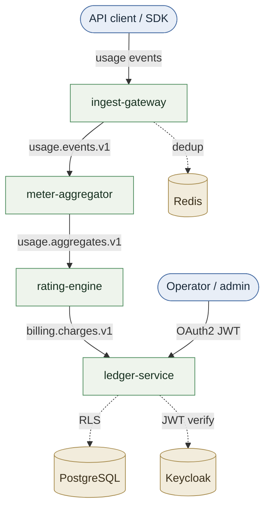

# Quotient

[](https://github.com/marciomarinho/quotient/actions/workflows/ci.yml)
[](LICENSE)
[](https://adoptium.net/)

**Token-level usage metering, rating, and ledger-grade billing — built for scale, runnable on a laptop.**

Quotient is a portfolio-grade demonstration of production monetization
infrastructure. It shows, end-to-end, how a modern usage-based billing platform
works: ingest token telemetry over HTTP, stream it through Kafka with per-tenant
partitioning and exactly-once processing, aggregate into billable meter
readings, rate against per-tenant pricing plans, and record every monetary
movement in a double-entry ledger with strict integrity invariants — all with
multi-tenant isolation at the API, Kafka, and database (PostgreSQL RLS) layers.

It also contains a rigorous, reproducible benchmark of two interchangeable
ingestion gateways: **Spring WebFlux** (reactive) vs **Spring MVC + virtual
threads** (Java 25, Project Loom).

Everything runs locally with `make up` — no cloud dependencies.

The whole pipeline is live: `make demo` fires ~10k events across three tenants
(with deliberate duplicates), aggregates → rates → posts to the ledger, generates
invoices via a transactional outbox, and asserts duplicates weren't billed and the
ledger balances — using real Keycloak OAuth2 tokens.

## Architecture



The arrows between services are Kafka topics (versioned, keyed by `tenantId`).
Full C4 (context / container / component) + sequence diagrams:
[`docs/ARCHITECTURE.md`](docs/ARCHITECTURE.md).

## Quickstart (90 seconds)

Requires **JDK 25** (Temurin or GraalVM), **Docker**, and **k6**.

```bash
make up        # start Kafka, Postgres, Redis, Prometheus, Grafana, Tempo, Keycloak, Toxiproxy
make build     # compile all modules (Gradle 9.6.1 via ./gradlew, JDK 25 toolchain)
make test      # unit tests
# make demo    # (Phase 7+) fire realistic traffic across 3 tenants and print invoices + ledger balances
```

### Local endpoints

| Service | URL | Notes |
|---|---|---|
| Kafka (host) | `localhost:29092` | in-network: `kafka:9092` |
| Kafka UI | http://localhost:8085 | topic/lag visibility |
| Postgres | `localhost:5432` | `quotient` / `quotient` |
| Redis | `localhost:6379` | idempotency dedup |
| Prometheus | http://localhost:9090 | exemplars enabled |
| Grafana | http://localhost:3001 | `admin` / `admin` |
| Tempo | http://localhost:3200 | traces |
| Keycloak | http://localhost:8081 | `admin` / `admin`, realm `quotient` |
| Toxiproxy | http://localhost:8474 | benchmark fault injection |

## Repository layout

```
quotient-common/          domain records, Money type, event schemas, tenant context
ingest-gateway-reactive/  WebFlux + reactor-kafka gateway
ingest-gateway-vthreads/  MVC + virtual threads gateway
meter-aggregator/         Kafka Streams aggregator (EOS v2)
rating-engine/            pricing + charge production
ledger-service/           double-entry ledger + invoicing + query API (Postgres, RLS)
loadtest/                 k6 scenarios + benchmark report generator
build-logic/              the single Gradle convention plugin ("parent POM")
infra/                    provisioned-as-code configs (Prometheus, Tempo, OTel, Grafana, Keycloak)
docs/                     PROBLEM, ARCHITECTURE, MULTI_TENANCY, SECURITY, LEDGER_DESIGN, EXACTLY_ONCE, BENCHMARK, adr/
```

## Design highlights

- **Correctness under concurrency:** idempotent ingestion, exactly-once
  aggregation, and ledger invariants enforced at three layers (DB trigger, app
  service, consumer idempotency).
- **Money is exact:** `long` minor units end-to-end; no floating point (ArchUnit-enforced).
- **Multi-tenancy done properly:** API key / JWT claim → tenant context → Kafka
  partitioning → PostgreSQL Row-Level Security.
- **Honest performance engineering:** reproducible k6 benchmark of reactive vs
  virtual-threads gateways with real local numbers.

## Documentation

| Doc | What it covers |
|---|---|
| [PROBLEM.md](docs/PROBLEM.md) | The consumption-billing problem and why the naive approach collapses |
| [ARCHITECTURE.md](docs/ARCHITECTURE.md) | C4 (context/container/component) + sequence diagrams |
| [MULTI_TENANCY.md](docs/MULTI_TENANCY.md) | Silo/bridge/pool decision matrix; the layered isolation implemented |
| [LEDGER_DESIGN.md](docs/LEDGER_DESIGN.md) | Double-entry design, three-layer invariants, invoicing, outbox |
| [EXACTLY_ONCE.md](docs/EXACTLY_ONCE.md) | Idempotency + exactly-once across the pipeline |
| [SECURITY.md](docs/SECURITY.md) | Dual-auth model, Keycloak tenant mapping, threat model |
| [OBSERVABILITY.md](docs/OBSERVABILITY.md) | Metrics, structured logs, tracing to Tempo (and its honest limit) |
| [BENCHMARK.md](docs/BENCHMARK.md) | WebFlux vs virtual threads — method, real numbers, analysis |
| [adr/](docs/adr/) | Architecture Decision Records (MADR) |

## Verification

- `make test` / `make itest` — unit + Testcontainers integration tests (Kafka,
  Postgres, Redis) across all modules.
- `make coverage` — aggregate JaCoCo HTML report.
- `make lint` — Spotless + Checkstyle.
- `make ledger-verify` — recompute all balances from entries and assert they match.
- CI (`.github/workflows/ci.yml`) runs lint + tests + coverage on every push/PR.

License: Apache-2.0.
