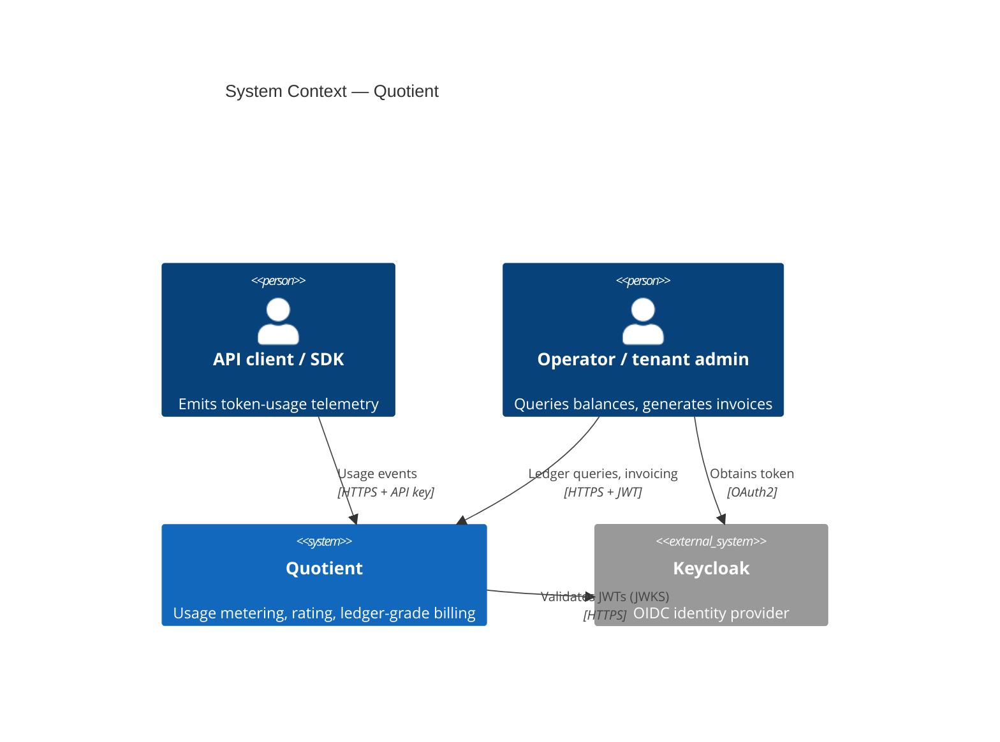
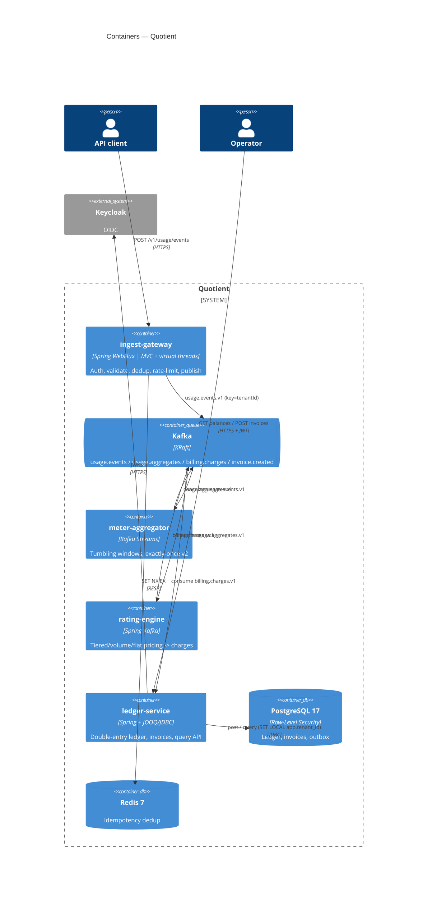
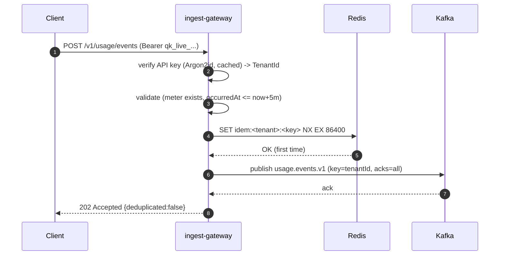
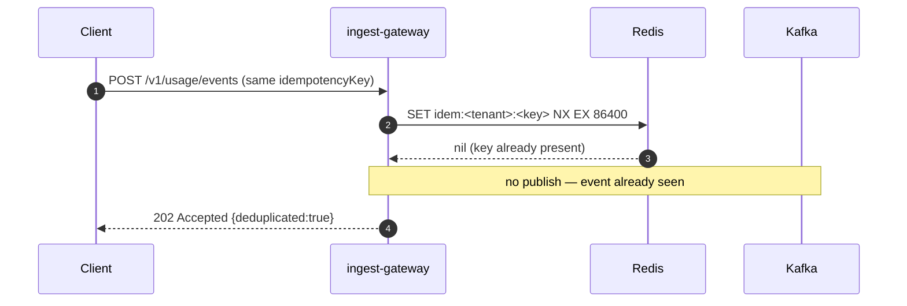

# Architecture

Quotient is a Kafka-backed pipeline: **ingest → aggregate → rate → post to a
double-entry ledger**, with multi-tenant isolation at every layer. This document
gives the C4 views and the key sequence flows. See [PROBLEM.md](PROBLEM.md) for
why, and the ADRs in [adr/](adr/) for the decisions.

## C4 — System Context



## C4 — Containers



## C4 — Component (ledger-service)

```mermaid
flowchart TB
    subgraph Ledger["ledger-service"]
        CL[ChargeListener<br/>Kafka consumer]
        PS[LedgerPostingService<br/>retry-on-40001]
        TW[TransactionalLedgerWriter<br/>SERIALIZABLE]
        DEP[DoubleEntryPosting<br/>domain]
        REPO[JdbcLedgerRepository<br/>RLS-bound]
        INV[InvoiceService]
        IREPO[JdbcInvoiceRepository]
        RELAY[OutboxRelay<br/>@Scheduled]
        QC[LedgerQueryController<br/>OAuth2 + @PreAuthorize]
        SEC[JwtTenantContextFilter<br/>tenant_id claim -> TenantContext]
    end
    KAFKA[(Kafka<br/>billing.charges.v1)] --> CL --> PS --> TW
    DEP --> PS
    TW --> REPO --> PG[(PostgreSQL + RLS)]
    SEC --> QC --> QSVC[LedgerQueryService] --> REPO
    INV --> IREPO --> PG
    RELAY --> PG
    RELAY --> OUT[(Kafka<br/>invoice.created.v1)]
```

## Sequence — event ingestion (happy path)



## Sequence — duplicate event rejection



## Sequence — window close → rating → ledger posting

```mermaid
sequenceDiagram
    autonumber
    participant A as meter-aggregator
    participant K as Kafka
    participant RT as rating-engine
    participant L as ledger-service
    participant P as PostgreSQL
    A->>A: window [t, t+1m) closes (grace 30s), suppress emits
    A->>K: usage.aggregates.v1 (MeterReading)
    K->>RT: consume MeterReading
    RT->>RT: apply tenant plan (tiered/volume/flat), record planVersion
    RT->>K: billing.charges.v1 (Charge, deterministic id)
    K->>L: consume Charge
    L->>P: SET LOCAL app.tenant_id; INSERT transaction ON CONFLICT DO NOTHING
    L->>P: INSERT balanced entries (DEBIT RECEIVABLE / CREDIT REVENUE + TAX)
    Note over P: deferred trigger asserts debits == credits at COMMIT
    L->>P: record billed_charge (for invoicing)
```

For invoice generation and the outbox flow, see [LEDGER_DESIGN.md](LEDGER_DESIGN.md).
