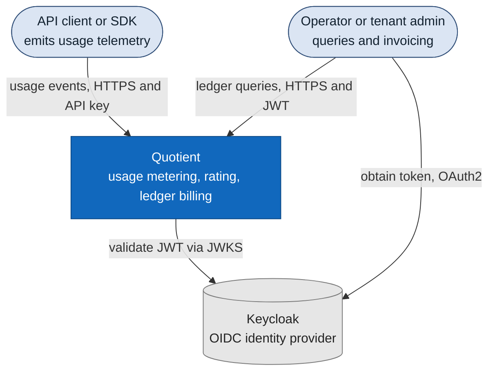
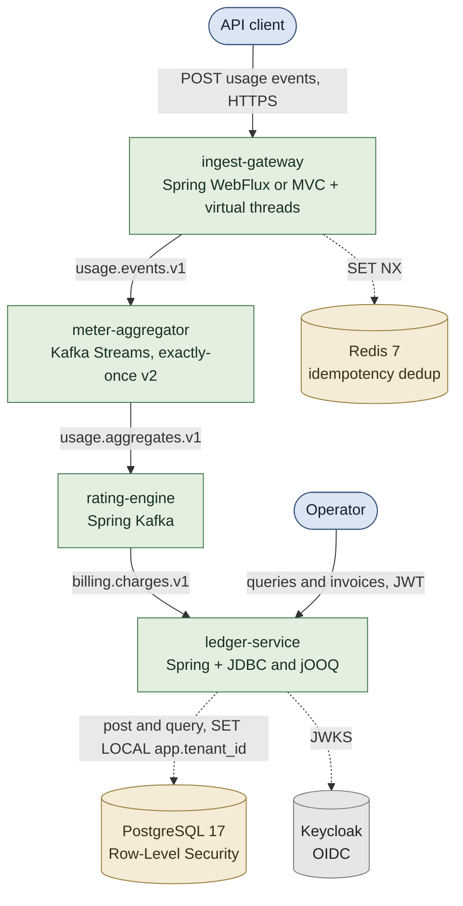
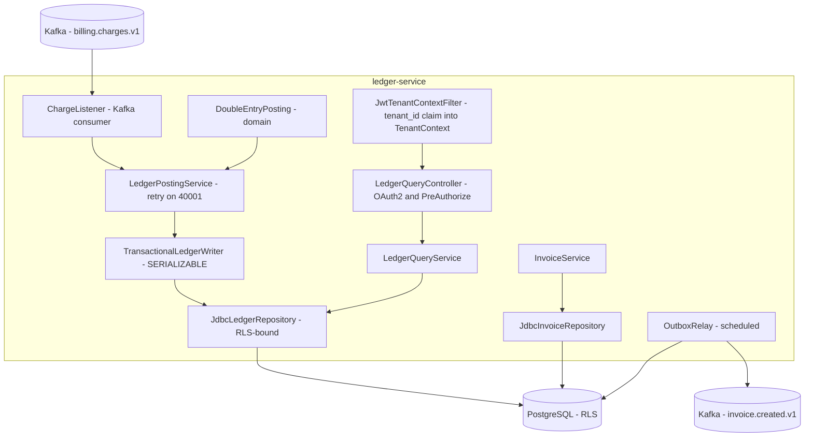
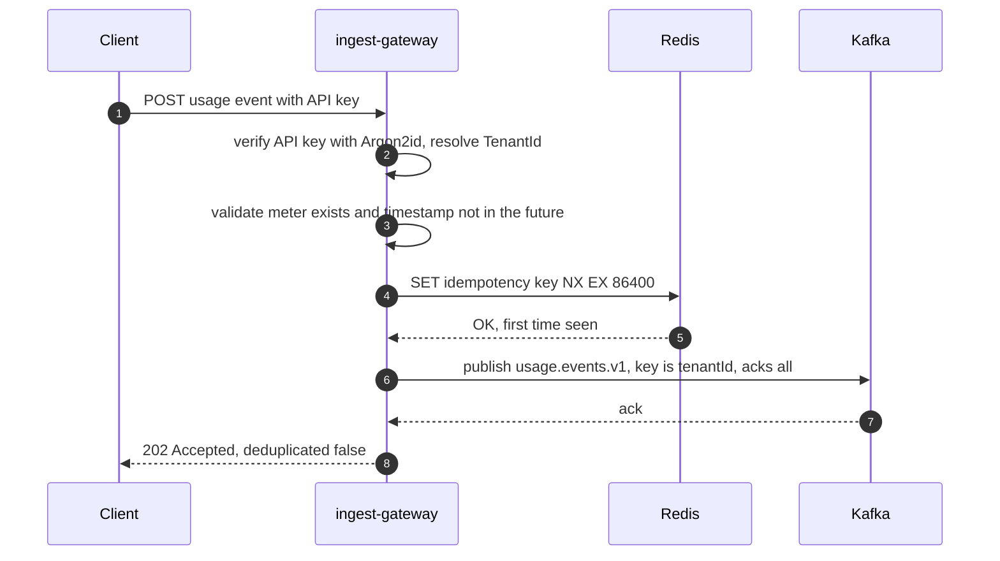
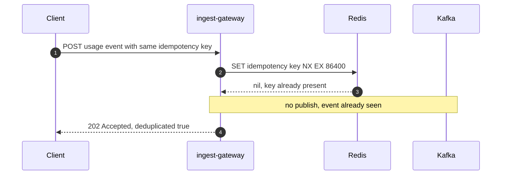
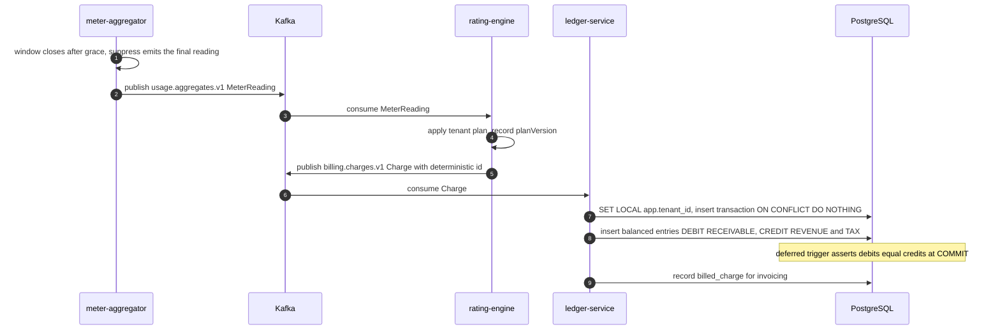

# Architecture

Quotient is a Kafka-backed pipeline: **ingest → aggregate → rate → post to a
double-entry ledger**, with multi-tenant isolation at every layer. This document
gives the C4 views and the key sequence flows. See [PROBLEM.md](PROBLEM.md) for
why, and the ADRs in [adr/](adr/) for the decisions.

## C4 — System Context

## C4 — Containers

Arrows between services are Kafka topics (versioned, keyed by `tenantId`);
dotted arrows are datastore access.

## C4 — Component (ledger-service)

## Sequence — event ingestion (happy path)

## Sequence — duplicate event rejection

## Sequence — window close → rating → ledger posting

For invoice generation and the outbox flow, see [LEDGER_DESIGN.md](LEDGER_DESIGN.md).
