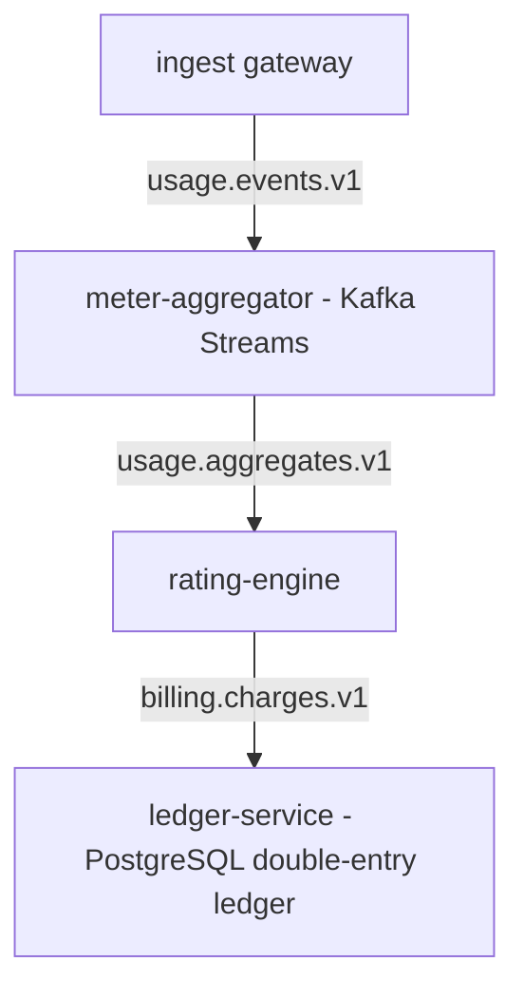
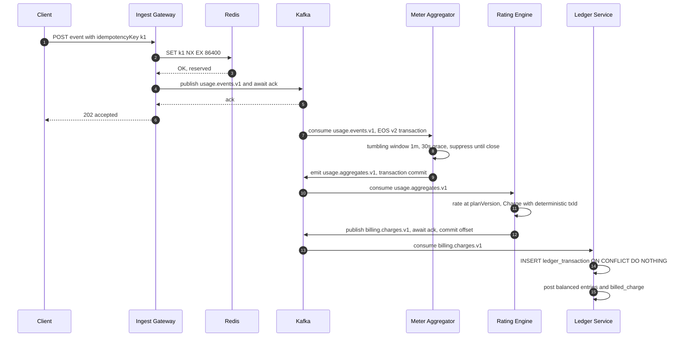
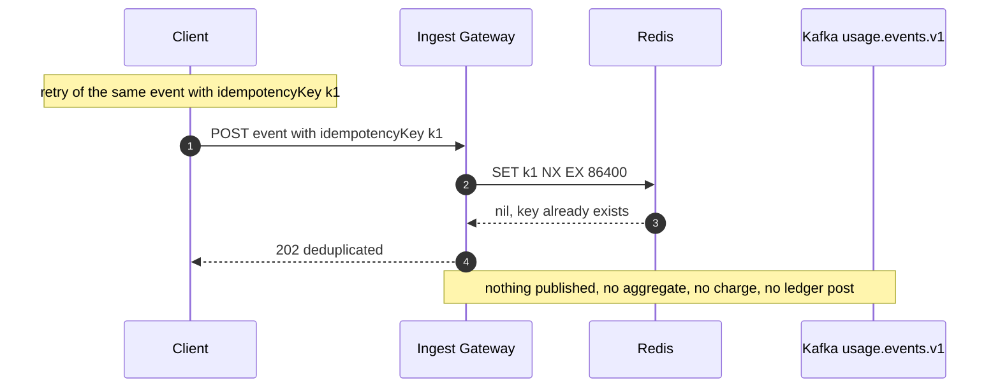

# Exactly-Once Semantics

Quotient meters usage in real time and turns it into money. If an event is
counted twice a tenant is overcharged; if it is dropped, revenue is lost.
This document explains how **idempotency and exactly-once semantics** are
achieved across the *whole* pipeline — not by a single magic setting, but by
choosing the right guarantee at each hop and composing them.

## 1. The chain



Each hop is independently safe under retries. The end-to-end property —
*every usage event affects the ledger exactly once* — emerges from the
per-hop guarantees below.

## 2. Ingestion idempotency

Every event carries a **client-supplied `idempotencyKey`**. The ingest gateway
deduplicates *before* publishing to Kafka using Redis:

```
SET <idempotencyKey> 1 NX EX 86400
```

- `NX` — set only if absent. If the key already exists the event is a
  **duplicate**: the gateway skips the publish and returns
  `HTTP 202 { "deduplicated": true }`.
- `EX 86400` — a **24-hour** dedup window.

**Trade-off — window vs storage.** A longer window catches later retries but
costs Redis memory proportional to event volume × window. 24h comfortably
covers client retry/backoff and outage windows while bounding key storage; it
is configurable per environment.

**Failure handling — the SET/publish ordering hazard.** The `SET NX` happens
*before* the Kafka publish. If the publish then **fails**, the key is already
claimed, and a client retry would see the key and be told "deduplicated" —
silently dropping an event that was never published. To prevent this, a failed
publish issues a **compensating `DEL`** of the key, releasing it so the
client's retry is accepted and actually published.

```
reserved = redis.set(key, "1", NX, EX=86400)
if not reserved:            return 202 {"deduplicated": true}
try:
    kafka.publish("usage.events.v1", event)   # await broker ack
except PublishError:
    redis.del(key)                            # compensate; allow retry
    raise
return 202 {"accepted": true}
```

The window here is: *at-least-once publish with client-key dedup* → effectively
**idempotent ingest**.

## 3. Aggregation exactly-once

The meter-aggregator is a **Kafka Streams** topology with:

```
processing.guarantee = exactly_once_v2
```

EOS v2 makes each read-process-write cycle a **single Kafka transaction**
spanning the input offsets, the state-store **changelog**, and the output
topic. Either all three commit or none do, so a crash-restart never
double-counts into an aggregate nor emits a partial output.

- **Windows:** tumbling, **1 minute** (configurable), with a **30-second
  grace** for late-arriving events.
- **Emission:** `suppress(untilWindowCloses())` so each window emits **exactly
  one final reading** — no intermediate updates flow downstream.

**Caveat — suppress needs stream-time to advance.** `suppress` flushes a window
only when **stream time** (derived from record timestamps) moves past
`windowEnd + grace`. A **stalled** partition — no new records — will *not*
advance stream time, so a closed window can sit un-emitted. The mitigation is
to keep a **continuous / heartbeat stream** flowing so windows keep closing on
schedule. This is a deliberate property of event-time suppression, not a bug:
correctness (one final reading) is preserved; only timeliness depends on
liveness.

## 4. Rating + ledger idempotency

The rating engine is **deterministic**: for a given final reading and a given
`planVersion`, rating always produces an **identical `Charge`**, including an
identical **deterministic transaction id**:

```
txId = uuidV5(NAMESPACE, "tenant|meter|window|dimensions|planVersion")
```

Delivery from the rating engine is **at-least-once**: it awaits the broker
**ack** for the published charge *before* committing its consumer offset, so a
crash between publish and offset-commit re-publishes the charge — never drops
it.

The ledger absorbs those duplicates. It posts the balanced transaction with:

```sql
INSERT INTO ledger_transaction (id, ...) VALUES (:txId, ...)
ON CONFLICT (id) DO NOTHING;
```

Because the id is deterministic, a re-delivered charge hits the existing row
and is a **no-op**. At-least-once in, exactly-once posted. (Money is `long`
minor units, **AUD**; see `LEDGER_DESIGN.md`.)

## 5. Guarantee per hop

| Hop        | Component        | Mechanism                                   | Guarantee              |
|------------|------------------|---------------------------------------------|------------------------|
| ingest     | gateway + Redis  | `SET NX EX 86400`, compensating `DEL`       | **idempotent dedup**   |
| aggregate  | Kafka Streams    | `exactly_once_v2` (tx read-process-write)   | **EOS v2**             |
| rate       | rating engine    | deterministic charge + deterministic `txId` | **deterministic**      |
| post       | ledger service   | `INSERT ... ON CONFLICT DO NOTHING`         | **idempotent insert**  |

Composition: idempotent ingest ∘ exactly-once aggregation ∘ deterministic
rating ∘ idempotent posting ⇒ **each event affects the ledger exactly once**,
under arbitrary retries and restarts at any hop.

## 6. Sequences: happy path and duplicate path

### Happy path



### Duplicate-event path



The duplicate is stopped at the very first hop: because `k1` is still present
in Redis, the gateway short-circuits to `202 { "deduplicated": true }` and
publishes nothing, so no aggregate, charge, or ledger posting is ever produced
for it.
