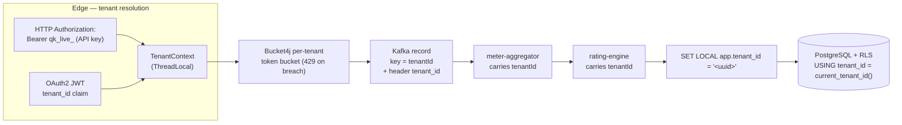

# Multi-Tenancy

Quotient is a shared, pooled platform serving thousands of tenants from one
deployment. **Tenant isolation is enforced at every layer of the pipeline — not
just the database.** A single missing check anywhere between the HTTP edge and
the last SQL statement would be a cross-tenant leak, so the isolation is defence
in depth: authentication, an in-process context, rate limiting, the message bus,
and the database each independently scope work to exactly one tenant.

## The three canonical models

Every multi-tenant system picks a point on the isolation-vs-cost curve. The
three canonical database models are Silo, Bridge, and Pool.

| | Silo (DB per tenant) | Bridge (schema per tenant) | **Pool (shared schema + RLS)** |
|---|---|---|---|
| Isolation | Strongest — physical, separate DBs | Strong — logical, separate schemas | Logical — one schema, row-scoped by RLS |
| Cost | Highest — N databases to provision/license | Medium — N schemas, one DB | Lowest — one schema shared by all |
| Ops complexity | High — N migrations, N backups, N connection pools | Medium — N schema migrations | Low — one migration, one backup, one pool |
| Blast radius | Contained per tenant | Mostly contained per schema | Platform-wide — an RLS policy bug can expose all tenants |
| Per-tenant scale ceiling | Limited by DB/host sprawl (tens–hundreds) | Limited by schema count (hundreds–low thousands) | Very high — thousands+ tenants in one DB |

### Why Pool

Quotient targets **thousands of small-to-medium metering tenants**. At that
count Silo and Bridge collapse under operational weight: N migrations to run on
every release, N backups to verify, N connection pools to size, N sets of
credentials to rotate. Pool gives one migration, one backup, one pool, and the
lowest marginal cost per tenant — the model used by most large SaaS metering
platforms.

**The honest trade-off:** Pool has the *weakest physical isolation* and the
*largest blast radius*. All tenants share one schema, so correctness rests on the
Row-Level Security (RLS) policies. A bug in a single RLS policy is not a
one-tenant incident — it is potentially a whole-platform incident. We mitigate
this with fail-closed policies (below), append-only ledger constraints (see
[LEDGER_DESIGN.md](LEDGER_DESIGN.md)), and an integration test suite that asserts
cross-tenant queries return zero rows.

**Escape hatch:** a tenant with a contractual or regulatory demand for *physical*
isolation is **promoted to the Bridge or Silo model** — a dedicated schema or a
dedicated database — rather than forcing the whole platform onto a more expensive
model. This mirrors the auth decision in [SECURITY.md](SECURITY.md): single realm
+ `tenant_id` claim (pooled) by default, realm-per-tenant for a tenant demanding
cryptographic IdP isolation. Same trade-off shape, same escape hatch.

## The layered isolation actually implemented

Tenant context is resolved once at the edge and then carried, unbroken, through
every hop.

1. **Authentication → tenant resolution.** Two paths converge on one tenant id
   (see [SECURITY.md](SECURITY.md)). Ingestion authenticates with a per-tenant
   API key (`Authorization: Bearer qk_live_...`), Argon2id-verified, mapping to
   exactly one tenant. The query/admin path uses an OAuth2 JWT whose `tenant_id`
   claim is the *only* source of tenant context — never a request parameter.

2. **`TenantContext` (thread-bound holder).** The resolved id is placed in a
   `ThreadLocal`-backed `TenantContext` for the duration of the request/consume.
   Nothing downstream re-derives the tenant; everything reads it from the
   context, so there is a single source of truth in-process. The context is
   cleared in a `finally` block to prevent leakage across pooled threads.

3. **Per-tenant token-bucket rate limiting (Bucket4j).** Each tenant gets its own
   token bucket keyed by tenant id. This is the **noisy-neighbour protection**: a
   tenant that bursts cannot starve others of throughput. On breach the gateway
   returns **HTTP 429** (with `Retry-After`) instead of degrading the shared
   pipeline.

4. **Kafka partitioning by `tenantId`.** Events are published with the tenant id
   as the **record key**, so all of a tenant's events land on the same partition.
   This gives **per-tenant ordering** and **downstream affinity** (a consumer
   instance handles a stable set of tenants), which the aggregator relies on for
   correct time-window rollups. The tenant id also travels in a record header for
   convenience.

5. **PostgreSQL Row-Level Security.** The application connects as the
   **non-superuser role `quotient_app`** (superusers bypass RLS, so this matters).
   At the start of every transaction it runs:

   ```sql
   SET LOCAL app.tenant_id = '11111111-1111-1111-1111-111111111111';
   ```

   Every table carries a `tenant_id` column and an RLS policy of the form:

   ```sql
   CREATE POLICY tenant_isolation ON usage_event
     USING (tenant_id = current_tenant_id());
   ```

   where `current_tenant_id()` reads the `app.tenant_id` session setting. Because
   `SET LOCAL` is transaction-scoped, the binding cannot leak to the next
   transaction on a pooled connection. **Fail closed:** if the setting is missing,
   `current_tenant_id()` resolves to `NULL`, the `USING` predicate is never true,
   and the statement **matches no rows** — a forgotten `SET LOCAL` yields zero
   data, never all data.

## Tenant-context propagation across the pipeline



The chain is unbroken: the id resolved at the edge is the same id used in the
Kafka key, the same id carried by the aggregator and rating engine, and the same
id bound with `SET LOCAL` under RLS. No stage re-derives the tenant from anything
the client controls.

## Proof

Cross-tenant isolation is not assumed — it is tested. The integration test
`craftedCrossTenantQuery_returnsZeroRowsUnderRls` binds the session to tenant A
(Acme, `11111111-1111-1111-1111-111111111111`) via `SET LOCAL app.tenant_id`,
then deliberately issues a query crafted to select tenant B's rows
(Globex, `22222222-2222-2222-2222-222222222222`). Under RLS the query returns
**zero rows** — the policy silently scopes it back to the bound tenant. The
companion auth-layer tests in [SECURITY.md](SECURITY.md)
(`aTokenForTenantACannotInvoiceTenantB`) prove the same invariant one layer up,
so a request for Initech (`33333333-3333-3333-3333-333333333333`) data on an Acme
token is rejected before it ever reaches SQL.
