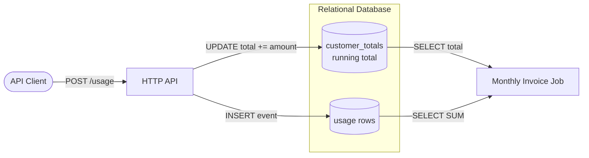

# The Problem Domain

> Audience: an engineer evaluating Quotient. This document explains _why_ usage
> metering and monetization is hard before any code is read. For the concrete
> solution, see [`ARCHITECTURE.md`](./ARCHITECTURE.md),
> [`LEDGER_DESIGN.md`](./LEDGER_DESIGN.md),
> [`EXACTLY_ONCE.md`](./EXACTLY_ONCE.md), and
> [`MULTI_TENANCY.md`](./MULTI_TENANCY.md).

## 1. Introduction

Modern API-first and AI companies no longer sell seats — they sell
**consumption**. You are charged for the tokens a model generated, the number of
requests you made, the gigabytes you stored or transferred, and the
compute-seconds your job burned. This "pay for what you use" model is great for
customers and aligns cost with value, but it moves an enormous amount of
complexity into the vendor's backend. Every billable action a customer takes is
now an _event_ that must be captured, counted, priced, and eventually turned
into an invoice line and a dollar figure that the customer will scrutinize.

Getting this wrong is not a cosmetic bug. Under-count and you leak revenue.
Over-count and you overcharge customers, trigger disputes, and lose trust.
Lose events and your books do not reconcile. Double-count events and a customer
gets billed twice for the same API call. **Quotient** is a real-time usage
metering and monetization platform built to solve exactly these problems. This
document lays out the five hard problems that any such system must confront.

## 2. The Five Hard Problems

### Volume

A single active customer can emit **millions of usage events per day** — imagine
a chatbot product fanning out one metering event per model call across thousands
of end users. Multiply by a customer base and the platform must sustain a very
high sustained write rate with bursty peaks. Ingestion therefore has to be
**cheap, fast, and non-blocking**: the hot path that accepts an event must do the
minimum work required to durably accept it and get out of the way. Our target is
a **p99 under 50 ms** for the ingestion endpoint (measured locally), which rules
out doing rating, aggregation, or synchronous relational writes inline with the
request. Anything expensive must happen asynchronously, downstream.

### Correctness

Billing errors destroy trust faster than almost any other class of bug, because
they cost the customer money and are trivially noticed. Two failure modes are
fatal. First, **double-counting**: if a client retries a request (as clients
always do), the same logical event must not be metered twice — the pipeline must
be **idempotent**. Second, **loss**: once we have acknowledged an event, it must
survive process crashes, restarts, and rebalances — it must be **durable**.
Finally, the monetary math itself must be **exact**. Floating point is banned;
money is represented as a `long` count of **minor units (cents)** in **AUD**, and
all pricing arithmetic is done in integers so that AUD 0.001 rounding errors
never accumulate across millions of line items.

### Multi-tenancy

Thousands of customers share the same physical infrastructure — the same Kafka
topics, the same PostgreSQL cluster, the same aggregation processes. Two
guarantees must hold. **Isolation**: one tenant must never, under any bug or
query, be able to read another tenant's usage or ledger data. **Fairness**: a
single tenant that suddenly spikes to 100x its normal volume — the "noisy
neighbour" — must not degrade latency or availability for everyone else.
Achieving both requires tenant identity to be a first-class concept threaded
through every layer: partitioning keys, row-level access rules, and quotas. See
[`MULTI_TENANCY.md`](./MULTI_TENANCY.md).

### Auditability

When a customer disputes an invoice, "trust me, the number is right" is not an
answer. Every **invoice line must trace back to the raw events** that produced
it, and every **dollar of movement must be explainable**. This is why Quotient
keeps raw events immutable, and why the money side is a **double-entry ledger**:
every charge is a balanced pair of entries, entries are **append-only** (never
updated or deleted), and corrections are made with compensating entries rather
than edits. This gives an unbroken chain from a raw metering event through the
rated amount to a ledger entry to an invoice line. See
[`LEDGER_DESIGN.md`](./LEDGER_DESIGN.md).

### Timeliness

Customers increasingly expect **near-real-time visibility** into spend: live
dashboards, spend **caps** that stop runaway usage, and **alerts** when they
cross a threshold. This is in direct tension with billing, which is naturally a
**batch** activity aligned to a monthly cycle. A system optimized purely for
end-of-month invoice generation cannot answer "how much have I spent in the last
five minutes?", while a system optimized only for live counters struggles to
produce the correct, finalized, auditable monthly invoice. Quotient must serve
both the fast approximate view and the slow authoritative one from the same
event stream.

## 3. The Naive Approach and Why It Collapses

The obvious first design: an HTTP API that writes each usage event directly into
a relational `usage` table, and in the same transaction increments a
per-customer running total.

This works in a demo and collapses in production for several compounding
reasons:

- **Hot rows / lock contention.** The `UPDATE customer_totals SET total = total
  + n` statement serializes every write for a given customer onto a single row.
  Under a busy tenant, threads queue on that row lock; throughput for that tenant
  is capped by how fast one row can be updated, not by the size of the cluster.
- **Write amplification.** Every event triggers a durable insert plus an index
  update plus a counter update plus WAL and replication traffic. The database is
  doing far more physical I/O than the logical "record one event" operation
  implies.
- **No replay / reprocessing.** The moment an event is rated and folded into a
  running total, the pricing decision is baked in. If a pricing tier was wrong,
  or rating logic changes, there is no clean way to recompute — the raw truth has
  been destroyed by aggregation.
- **No audit trail.** A running total cannot explain itself. There is no record
  of which events, at which prices, produced the number, so disputes are
  unanswerable.
- **Ingestion latency coupled to DB write latency.** The client's request cannot
  return until the database commits. A slow disk, a lock wait, a vacuum, or a
  failover directly inflates the p99 of the public ingestion endpoint.
- **No natural backpressure.** When the database saturates, requests do not
  queue gracefully — they time out and clients retry, which adds _more_ load
  (and, without idempotency, more double-counting) precisely when the system is
  already overloaded.

## 4. How Quotient Addresses Each

Quotient decomposes the problem into a streaming pipeline so that the hot path
does almost nothing and the expensive, correctness-critical work happens
asynchronously and idempotently downstream. Full detail is in
[`ARCHITECTURE.md`](./ARCHITECTURE.md).

- **Volume — high-concurrency ingestion gateway.** The public entry point is a
  thin **HTTP ingestion gateway** whose only job is to validate, deduplicate, and
  hand off. It ships in two interchangeable implementations — **Spring WebFlux**
  (reactive) and **Spring MVC on Java 25 virtual threads** — so the design is
  proven under both concurrency models. It never touches the billing database on
  the request path, which is how it holds p99 under 50 ms.

- **Correctness — dedup + durable log.** Each event carries a client-supplied
  idempotency key. The gateway performs a **Redis `SET NX`** check to reject
  duplicates cheaply, then **publishes to Kafka keyed by `tenantId`**. Kafka is
  the durable, ordered source of truth: once the record is acknowledged it cannot
  be lost, and keying guarantees per-tenant ordering. Exactly-once semantics are
  carried end-to-end (see below and [`EXACTLY_ONCE.md`](./EXACTLY_ONCE.md)). All
  monetary values stay `long` cents in AUD.

- **Volume/Timeliness — Kafka Streams meter-aggregator.** A **Kafka Streams**
  application consumes the event topic and folds events into per-tenant,
  per-meter counts using **tumbling windows**, running under **exactly-once v2
  (EOS v2)**. This replaces the contended counter row with a partitioned,
  horizontally scalable, replayable aggregation, and it emits windowed totals
  fast enough to power live spend, caps, and alerts.

- **Correctness — versioned rating engine.** A **rating engine** turns aggregated
  usage into money by applying **versioned pricing** — tiered, volume, and flat
  schemes. Because pricing is versioned and applied downstream of the immutable
  event log, plans can change and history can be recomputed without corrupting
  past invoices. All arithmetic is integer cents.

- **Auditability — double-entry ledger.** Rated amounts land in a **double-entry
  ledger in PostgreSQL**. Entries are **append-only** and balanced; corrections
  are compensating entries, never edits. This gives the event → rating → ledger →
  invoice traceability that makes every dollar explainable. See
  [`LEDGER_DESIGN.md`](./LEDGER_DESIGN.md).

- **Multi-tenancy — keys + Row-Level Security.** `tenantId` is the Kafka
  partition key (isolating and load-balancing tenants across partitions, taming
  the noisy neighbour), and PostgreSQL **Row-Level Security** enforces that every
  query is scoped to its tenant at the database itself — isolation that a
  mistaken application query cannot bypass. See
  [`MULTI_TENANCY.md`](./MULTI_TENANCY.md).

- **Observability — metrics and traces.** The pipeline is instrumented with
  **Micrometer → Prometheus → Grafana** for metrics and **OpenTelemetry → Tempo**
  for distributed traces, so latency, throughput, lag, and per-tenant behavior
  are visible and the p99 target is continuously verifiable.
