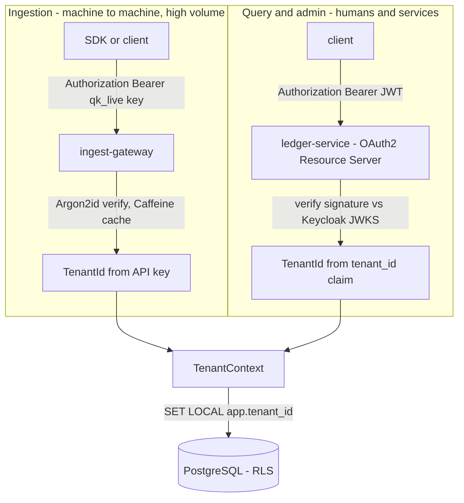

# Security Architecture

Quotient uses **two authentication mechanisms, chosen per traffic profile**, that
converge on one tenant-context chain. This is a deliberate design decision
(ADR-0010), not an accident of history.

## Two paths, one tenant context

### 1. Ingestion path — API keys

High-volume telemetry authenticates with per-tenant API keys
(`Authorization: Bearer qk_live_...`), verified in-process against Argon2id
hashes with a Caffeine cache. Rationale: SDK simplicity, no token-refresh failure
modes at 2k RPS, no IdP in the hot path — the same model Stripe/OpenAI/Datadog
use for ingestion. Key rotation is supported (two active keys per tenant).

### 2. Query / admin path — OAuth2 + OIDC (Keycloak)

The ledger's REST API is a Spring Security **OAuth2 Resource Server**. It
validates Keycloak-issued JWTs locally against the realm JWKS (cached; no
per-request IdP call). The realm is provisioned **as code**
(`infra/keycloak/quotient-realm.json`, imported at startup — no manual clicking).

- **Roles** (`realm_access.roles` → Spring `ROLE_*`): `tenant-admin`
  (invoices, keys), `tenant-viewer` (read-only), `platform-operator`
  (cross-tenant; the demo operator). Enforced with `@PreAuthorize` method security.
- **Critical invariant:** the `tenant_id` JWT claim is the *only* source of
  tenant context on this path. It feeds the same `TenantContext` →
  `SET LOCAL app.tenant_id` chain as the API-key path. A token for tenant A can
  never read or write tenant B's data even if the URL names B — proven by
  `LedgerAuthorizationIntegrationTest` (`aTokenForTenantACannotInvoiceTenantB` → 403,
  `aTokenSeesOnlyItsOwnTenantsBalances`). Authorization is derived from the
  token, never from a request parameter.
- **Flows:** `client_credentials` for service-to-service (used by `make demo`,
  which acquires real tokens headlessly before invoicing and querying).

## Single realm + `tenant_id` claim vs realm-per-tenant

This mirrors the pool/bridge/silo database analysis in
[MULTI_TENANCY.md](MULTI_TENANCY.md) — the same trade-off shape (isolation vs
operational cost).

| | Single realm + claim (**chosen**) | Realm per tenant |
|---|---|---|
| Isolation | Logical (claim + RLS) | Strong (separate realms, keys) |
| Ops cost | Low — one realm to manage | High — N realms, N key rotations |
| Onboarding | Add a client + claim | Provision a whole realm |
| Blast radius | Realm-wide misconfig affects all | Contained per tenant |
| Scale ceiling | Thousands of clients easily | Realm sprawl |

For a shared, pooled platform the single-realm model matches the pooled database
model; a tenant demanding cryptographic IdP isolation would be moved to its own
realm, exactly as a tenant demanding physical DB isolation would be moved to the
silo model.

## Threat model

| Threat | Mitigation |
|---|---|
| **Spoofed tenant** (client claims to be another tenant) | Ingestion: API key maps to exactly one tenant (Argon2id-verified). Query: `tenant_id` is a signed JWT claim, never a request parameter; path/param values are checked *against* the claim, not trusted. |
| **Replayed event** (duplicate ingestion) | Idempotency key deduped in Redis before publish; downstream posting is idempotent on a deterministic charge id (`ON CONFLICT DO NOTHING`). |
| **Stolen API key** | Keys are hashed at rest (Argon2id); rotation supported (two active keys) so a leaked key can be retired without downtime; per-tenant rate limits cap blast radius. |
| **Cross-tenant query** (A tries to read B) | PostgreSQL RLS scopes every statement to `app.tenant_id`; even a crafted query naming B returns zero rows (`craftedCrossTenantQuery_returnsZeroRowsUnderRls`). Role + path-vs-claim checks reject the request first. |
| **Stolen JWT** | Short token lifespan (5 min); local signature validation; roles are least-privilege (viewer/admin/operator). |
| **Tampered ledger history** | Append-only entries (UPDATE/DELETE revoked from the app role); balanced-transaction DB trigger; `ledger-verify` recomputes balances in CI. |

Auth failures (401/403) are per-tenant-tagged metrics on the Grafana dashboards;
token-validation spans appear in Tempo traces.
